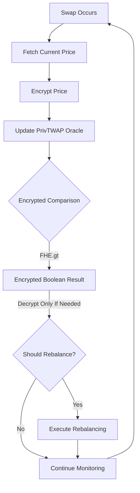

# 🌑 shadowMind

**Where Intelligence and Capital Operate in Complete Darkness**

A conceptual framework for a fully autonomous Uniswap v4 hook leveraging Fhenix's Fully Homomorphic Encryption (FHE) to enable blind AI-driven liquidity management.

[](https://getfoundry.sh/)
[](https://opensource.org/licenses/MIT)
[]()

---

## 🎯 Project Description

shadowMind is a **conceptual framework** for a fully autonomous Uniswap v4 hook designed to leverage Fhenix's Fully Homomorphic Encryption (FHE) infrastructure. We are currently researching the implementation of a **"blind" AI agent** capable of rebalancing liquidity positions entirely on encrypted data.

The proposed architecture aims to integrate an encrypted Time-Weighted Average Price (**PrivTWAP**) oracle directly into the hook, allowing computations on ciphertext without decryption. If realized, this design seeks to mitigate **MEV and Just-In-Time (JIT) liquidity attacks** by keeping decision parameters hidden from public view.

Our goal is to determine if this privacy-preserving model can significantly enhance capital efficiency for Liquidity Providers by preventing adversarial front-running. Ultimately, shadowMind will demonstrate the full potential of **programmable privacy**, creating a DeFi environment where intelligence and capital operate in complete darkness.

---

## 🧠 Core Concept

### The Vision: Blind Intelligence

Traditional DeFi protocols expose all decision logic on-chain, making them vulnerable to:
- 🎯 **MEV Exploitation** - Bots front-run rebalancing actions
- ⚡ **JIT Liquidity Sniping** - Attackers predict and exploit known thresholds
- 👁️ **Strategy Leakage** - Public parameters reveal LP intentions
- 🤖 **Adversarial Manipulation** - Price manipulation to trigger specific behaviors

shadowMind proposes a radical alternative: **computation on encrypted data**.

```
┌─────────────────────────────────────────────┐
│   Traditional DeFi Hook                     │
├─────────────────────────────────────────────┤
│ if (price > publicThreshold) {              │
│     rebalance();  // ❌ MEV exploitable     │
│ }                                           │
└─────────────────────────────────────────────┘

┌─────────────────────────────────────────────┐
│   shadowMind Hook (FHE-Powered)             │
├─────────────────────────────────────────────┤
│ ebool shouldRebalance =                     │
│     FHE.gt(encPrice, encThreshold);         │
│ // ✅ Decision logic operates in darkness   │
└─────────────────────────────────────────────┘
```

### What Makes shadowMind Unique?

1. **Encrypted Decision Parameters** - Thresholds, targets, and intervals remain ciphertext
2. **PrivTWAP Oracle** - Time-weighted pricing without revealing price observations
3. **Blind AI Agent** (Research) - Future integration with encrypted ML models
4. **On-Chain Privacy** - No trusted off-chain components or TEEs
5. **MEV Resistance** - Unpredictable behavior prevents front-running

---

## 🏗️ Architecture (Research Phase)

### Current Implementation

#### 1. **ShadowMindHook.sol**
The Uniswap v4 hook contract implementing encrypted state management:
- ✅ Encrypted pool configuration (thresholds, targets, intervals)
- ✅ PrivTWAP oracle integration
- ✅ Encrypted rebalancing decision logic
- 🔬 Placeholder for blind AI agent integration

#### 2. **PrivTWAPLib.sol**
Privacy-preserving TWAP oracle library:
- ✅ Encrypted price observation storage
- ✅ FHE arithmetic operations (add, multiply, divide)
- ✅ TWAP calculation on ciphertext
- ✅ Encrypted threshold comparisons

### Privacy Model

| Component | Status | Purpose |
|-----------|--------|---------|
| 🔒 Rebalancing thresholds | **Encrypted** | Hide trigger points from MEV bots |
| 🔒 Target liquidity amounts | **Encrypted** | Conceal strategy parameters |
| 🔒 TWAP calculations | **Encrypted** | Private price analytics |
| 🔒 Update intervals | **Encrypted** | Unpredictable timing |
| 🔒 AI decision weights | **Encrypted** (Future) | Blind intelligence |
| 🔓 Swap amounts | **Public** | Inherent to DEX design |
| 🔓 Pool addresses | **Public** | Network visibility |

### Encrypted Computation Flow



---

## 🔬 Research Questions

This project seeks to answer:

1. **Feasibility**: Can FHE operations be practical for real-time DeFi applications?
2. **Gas Efficiency**: What is the cost overhead of encrypted computation?
3. **Privacy Guarantees**: How much can we hide without breaking DEX functionality?
4. **MEV Resistance**: Does encryption meaningfully reduce extractable value?
5. **AI Integration**: Can encrypted ML models make autonomous decisions on-chain?
6. **Capital Efficiency**: Do LPs benefit from privacy-preserving rebalancing?

---

## 🚀 Quick Start

### Prerequisites

- [Foundry](https://book.getfoundry.sh/getting-started/installation) (stable)
- Basic understanding of Uniswap v4 hooks
- Familiarity with FHE concepts

### Installation

```bash
# Clone the repository
cd shadowmind

# Install dependencies
forge install

# Build contracts
forge build

# Run tests (when available)
forge test
```

---

## 📖 Usage (Conceptual)

### Deploying the Hook

```solidity
// Deploy shadowMind hook
ShadowMindHook hook = new ShadowMindHook(
    poolManager,  // Uniswap v4 PoolManager
    owner         // Configuration owner
);
```

### Initializing with Encrypted Configuration

```solidity
// Prepare encrypted parameters
InEuint64 memory encryptedPrice = /* FHE.asEuint64(...) */;
InEuint32 memory encryptedThreshold = /* encrypted 5% */;
InEuint64 memory encryptedTarget = /* encrypted liquidity target */;

bytes memory hookData = abi.encode(
    encryptedPrice,
    encryptedTimestamp,
    encryptedThreshold,
    encryptedTarget,
    encryptedInterval
);

// Initialize pool with encrypted state
poolManager.initialize(poolKey, sqrtPriceX96, hookData);
```

### Autonomous Rebalancing (Encrypted)

```solidity
// On every swap, the hook:
// 1. Updates encrypted TWAP oracle
oracle.update(encryptedPrice, encryptedTimestamp);

// 2. Computes encrypted decision
ebool shouldRebalance = FHE.gt(encryptedTWAP, encryptedThreshold);

// 3. Executes if threshold exceeded (minimal decryption)
if (FHE.decrypt(shouldRebalance)) {
    executeRebalancing();
}
```

---

## 🗺️ Research Roadmap

### ✅ Phase 1: Foundation (Current)
**Q4 2024 - Proof of Concept**

- [x] Core hook architecture design
- [x] PrivTWAP library implementation
- [x] FHE integration with Fhenix CoFHE
- [x] Basic encrypted decision logic
- [ ] Comprehensive test suite
- [ ] Gas benchmarking and analysis
- [ ] Security assumptions documentation

**Deliverable**: Working prototype demonstrating encrypted TWAP and basic rebalancing.

---

### 🔨 Phase 2: Enhanced Privacy
**Q1 2025 - Advanced Encryption**

- [ ] **Minimize Decryption Points**: Eliminate unnecessary FHE.decrypt() calls
- [ ] **Encrypted Control Flow**: Use FHE.select() for branching logic
- [ ] **Advanced PrivTWAP**: Volume-weighted and exponential moving averages
- [ ] **Multi-Pool Coordination**: Cross-pool encrypted state sharing
- [ ] **Encrypted Events**: Emit encrypted logs for privacy-preserving analytics

**Deliverable**: Production-grade FHE implementation with minimal information leakage.

---

### 🤖 Phase 3: Blind AI Integration
**Q2 2025 - Autonomous Intelligence**

- [ ] **Research Encrypted ML**: Explore FHE-compatible machine learning models
- [ ] **Off-Chain AI Agent**: Build agent that operates on encrypted pool data
- [ ] **On-Chain Inference**: Integrate encrypted model predictions into hook
- [ ] **Strategy Optimization**: Auto-tune parameters based on encrypted feedback
- [ ] **Risk Management**: Encrypted volatility analysis and position sizing

**Deliverable**: Fully autonomous "blind" AI agent managing liquidity on encrypted data.

---

### 🌐 Phase 4: Production Deployment
**Q3 2025 - Real-World Testing**

- [ ] **Fhenix Testnet Deployment**: Test with real FHE infrastructure
- [ ] **Security Audit**: Professional audit of FHE implementation
- [ ] **Gas Optimization**: Batch operations and circuit optimization
- [ ] **ZK Integration**: Combine FHE with zero-knowledge proofs
- [ ] **User Testing**: Beta program with select LPs
- [ ] **Mainnet Launch**: Production deployment on Fhenix

**Deliverable**: Audited, production-ready shadowMind hook on mainnet.

---

### 🔬 Phase 5: Research & Publications
**Ongoing - Knowledge Sharing**

- [ ] **Academic Paper**: Formal analysis of privacy guarantees
- [ ] **MEV Research**: Quantify MEV reduction from encryption
- [ ] **FHE Benchmarks**: Performance comparison vs. traditional approaches
- [ ] **Privacy-Preserving Oracles**: Encrypted price feed research
- [ ] **Cross-Chain Privacy**: Bridge encrypted state across L1/L2s
- [ ] **Open Source Tooling**: Libraries for FHE-based DeFi

**Deliverable**: Published research advancing privacy-preserving DeFi.

---

## 🧪 Technical Deep Dive

### FHE Type System

shadowMind uses Fhenix's encrypted types for on-chain privacy:

| Type | Bits | Use Case | Example |
|------|------|----------|---------|
| `euint64` | 64 | Prices, liquidity | `FHE.asEuint64(price)` |
| `euint32` | 32 | Timestamps, thresholds | `FHE.asEuint32(threshold)` |
| `euint16` | 16 | Update intervals | `FHE.asEuint16(60)` |
| `ebool` | 1 | Comparison results | `FHE.gt(a, b)` |

### PrivTWAP Oracle Design

```solidity
// Encrypted price observation
struct PrivateObservation {
    euint64 priceCumulative;  // Σ(price * time)
    euint32 timestamp;         // Encrypted timestamp
    bool initialized;
}

// Calculate TWAP on encrypted data
function getEncryptedTWAP() internal view returns (euint64) {
    euint32 timeDelta = FHE.sub(current.timestamp, previous.timestamp);
    euint64 priceDelta = FHE.sub(current.priceCumulative, previous.priceCumulative);
    
    // Division on ciphertext
    return FHE.div(priceDelta, FHE.asEuint64(timeDelta));
}
```

### Encrypted Decision Logic

```solidity
function _checkRebalanceCondition(PoolId poolId) 
    internal view returns (ebool) 
{
    // All computations on encrypted data
    euint64 encryptedTWAP = config.oracle.getEncryptedTWAP();
    euint64 threshold = FHE.asEuint64(config.rebalanceThreshold);
    
    // Comparison returns encrypted boolean
    return FHE.gt(encryptedTWAP, threshold);
}

// Minimal decryption at execution point
ebool shouldRebalance = _checkRebalanceCondition(poolId);
if (FHE.decrypt(shouldRebalance)) {
    executeRebalancing();
}
```

---

## ⚠️ Limitations & Research Challenges

### Current Limitations

1. **Partial Privacy**: Swap amounts remain visible (DEX transparency requirement)
2. **Gas Overhead**: FHE operations are computationally expensive
3. **Mock FHE**: Current implementation uses test environment
4. **Placeholder Rebalancing**: Actual liquidity modification not implemented
5. **No AI Agent**: Blind intelligence layer is future research

### Open Research Questions

- **Decryption Trade-offs**: How much decryption is acceptable for usability?
- **FHE Performance**: Can we achieve sub-second encrypted computations?
- **Privacy Proofs**: Formal verification of information leakage
- **AI Feasibility**: Can encrypted neural networks operate on-chain?
- **Economic Impact**: Does privacy actually improve LP returns?

### Security Considerations

> ⚠️ **Research Status**: This is experimental software for research purposes.

- Decryption points reduce privacy - minimize strategically
- Access control critical for encrypted parameter updates
- Sandwich attacks still possible on public swap amounts
- Requires extensive testing before real capital deployment
- FHE security assumptions must be validated

---

## 📁 Project Structure

```
shadowmind/
├── src/
│   ├── ShadowMindHook.sol          # Main hook contract
│   └── libraries/
│       └── PrivTWAPLib.sol         # Encrypted TWAP oracle
├── test/
│   └── ShadowMindHook.t.sol        # Test suite (in progress)
├── lib/
│   ├── cofhe-contracts/            # Fhenix FHE library
│   ├── uniswap-hooks/              # Uniswap v4 hooks framework
│   ├── v4-core/                    # Uniswap v4 core contracts
│   └── ...
├── foundry.toml                     # Foundry configuration
├── remappings.txt                   # Import path mappings
├── SHADOWMIND.md                    # Detailed technical documentation
└── README.md                        # This file
```

---

## 🤝 Contributing

This is an **active research project**. We welcome:

- 🔬 Research collaborations on FHE and privacy-preserving DeFi
- 💡 Ideas for encrypted ML integration
- 🐛 Bug reports and security findings
- 📝 Documentation improvements
- 🧪 Test coverage contributions

### How to Contribute

1. Fork the repository
2. Create a feature branch (`git checkout -b research/new-idea`)
3. Document your research or changes
4. Submit a pull request with detailed explanation

---

## 📖 Resources

### Documentation
- [Technical Documentation (SHADOWMIND.md)](./SHADOWMIND.md)
- [Uniswap v4 Docs](https://docs.uniswap.org/contracts/v4/overview)
- [Fhenix FHE Documentation](https://docs.fhenix.io/)
- [v4-by-example](https://v4-by-example.org)

### Academic Background
- [Fully Homomorphic Encryption](https://en.wikipedia.org/wiki/Homomorphic_encryption)
- [MEV in DeFi](https://ethereum.org/en/developers/docs/mev/)
- [Privacy-Preserving Smart Contracts](https://eprint.iacr.org/)

### Related Projects
- [Uniswap v4-core](https://github.com/uniswap/v4-core)
- [Fhenix CoFHE](https://github.com/fhenixprotocol/cofhe-contracts)
- [Private DeFi Research](https://www.paradigm.xyz/)

---

## 📄 License

MIT License - see [LICENSE](./LICENSE) for details

---

## 🙏 Acknowledgments

- **Fhenix Protocol** - FHE infrastructure and research partnership
- **Uniswap Foundation** - v4 hooks framework
- **Privacy Research Community** - Inspiration and collaboration
- **Foundry Team** - Development tooling

---

## ⚡ Disclaimer

> **This is experimental research software.**
>
> - ❌ **Not production-ready** - Requires extensive testing and auditing
> - ❌ **Research phase** - Concepts may not be fully realizable
> - ❌ **Gas costs unknown** - Production FHE overhead not yet benchmarked
> - ❌ **Privacy assumptions** - Theoretical guarantees need formal proof
> - ❌ **No financial advice** - Do not deploy with real capital
>
> Use at your own risk. This project explores the **frontier of programmable privacy** in DeFi.

---

<div align="center">

**🌑 shadowMind**

*Where Intelligence and Capital Operate in Complete Darkness*

**Research • Privacy • Autonomy**

</div>
